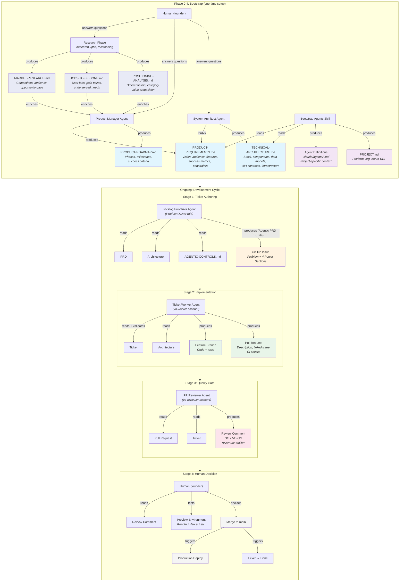
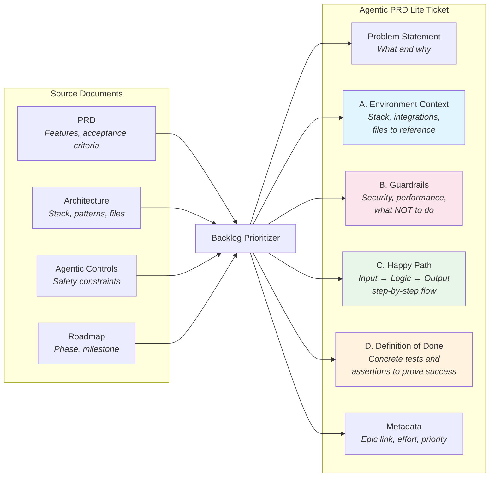
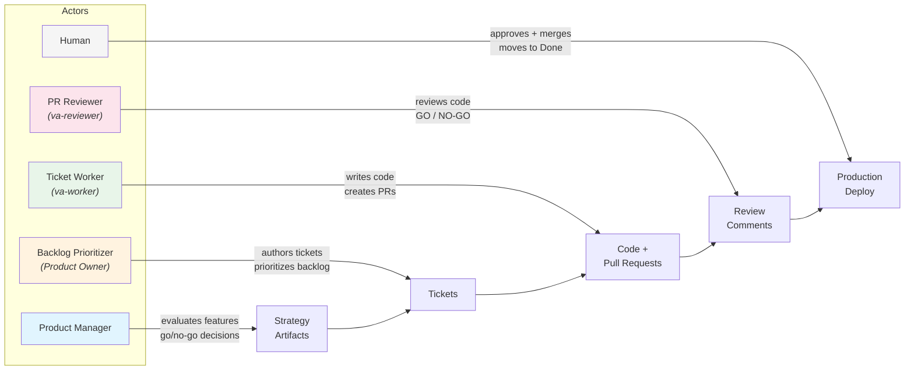
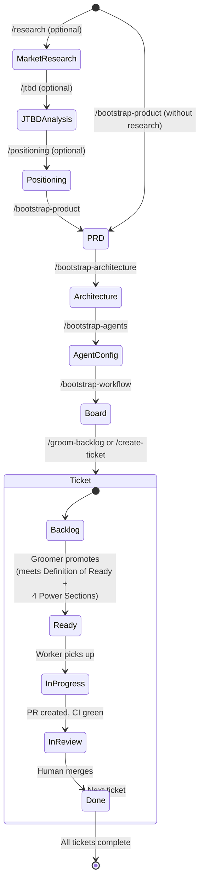

# Artifact Flow

How documents, tickets, and code flow through the Agile Flow system — who
produces each artifact, what it contains, and who consumes it.

---

## System Overview

---

## Artifact Detail: The Ticket (Agentic PRD Lite)

The ticket is the critical handoff artifact between the groomer and the
worker. It must be dense enough that the worker agent can implement without
hallucinating missing constraints.

### Where Each Section Comes From

| Section | Primary Source | What the Groomer Extracts |
|---------|--------------|--------------------------|
| Problem | PRD feature list | Why this matters, who benefits |
| A. Environment Context | TECHNICAL-ARCHITECTURE.md | Stack, framework, existing patterns, files to modify |
| B. Guardrails | AGENTIC-CONTROLS.md + PRD constraints | Security rules, performance targets, explicit prohibitions |
| C. Happy Path | PRD acceptance criteria + architecture | Step-by-step Input → Logic → Output for this feature |
| D. Definition of Done | PRD success metrics + test patterns | Specific tests, endpoints, assertions that prove completion |
| Metadata | PRODUCT-ROADMAP.md | Epic link, phase alignment, effort estimate, priority |

---

## Separation of Duties

No single actor can take a change from idea to production alone.

### Authority Matrix

| Actor | Creates | Reads | Cannot Do |
|-------|---------|-------|-----------|
| Product Manager | PRD, Roadmap, feature evaluations | All docs | Write code, manage backlog |
| Backlog Prioritizer | Tickets, priorities, epics | PRD, Roadmap, Architecture, Controls | Write code, review PRs, merge |
| Ticket Worker (bot) | Branches, code, tests, PRs | Tickets, Architecture, CLAUDE.md | Merge PRs, move to Done, push to main |
| PR Reviewer (bot) | Review comments, GO/NO-GO | PRs, tickets, code diffs | Merge PRs, move to Done, write code |
| Human | Merge decisions, Done status | Everything | N/A (full authority) |

---

## Artifact Lifecycle

---

## Quick Reference: Commands and Artifacts

| Command | Actor | Reads | Produces |
|---------|-------|-------|----------|
| `/research` | Product Manager | Human answers, web search | MARKET-RESEARCH.md |
| `/jtbd` | Product Manager | Human answers, MARKET-RESEARCH.md (optional) | JOBS-TO-BE-DONE.md |
| `/positioning` | Product Manager | Human answers, MARKET-RESEARCH.md + JOBS-TO-BE-DONE.md (optional) | POSITIONING-ANALYSIS.md |
| `/bootstrap-product` | Product Manager | Human answers, research artifacts (optional) | PRD, Roadmap |
| `/bootstrap-architecture` | System Architect | PRD | Architecture doc |
| `/bootstrap-agents` | Bootstrap skill | PRD, Architecture | Agent configs |
| `/bootstrap-workflow` | Workflow skill | CLAUDE.md | Board, branch protection, initial backlog |
| `/groom-backlog` | Backlog Prioritizer | PRD, Roadmap, Architecture, Controls | Refined tickets in Ready column |
| `/create-ticket` | Backlog Prioritizer | PRD, Architecture, Controls | Single ticket in Backlog |
| `/work-ticket` | Ticket Worker | Ticket, Architecture | Branch, code, tests, PR |
| `/review-pr` | PR Reviewer | PR, ticket, code diff | Review comment (GO/NO-GO) |
| `/sprint-status` | Any agent | Board state | Status report |
| `/evaluate-feature` | Product Manager | PRD, Roadmap | BUILD/DEFER/DECLINE decision |
| `/release-decision` | Product Manager | Board, PRD, metrics | GO/NO-GO release decision |

---

## See Also

- [TICKET-FORMAT.md](TICKET-FORMAT.md) — Canonical Agentic PRD Lite template
- [AGENT-WORKFLOW-SUMMARY.md](AGENT-WORKFLOW-SUMMARY.md) — Detailed workflow documentation
- [AGENTIC-CONTROLS.md](AGENTIC-CONTROLS.md) — 8-layer defense-in-depth controls
